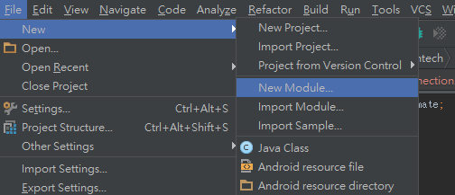
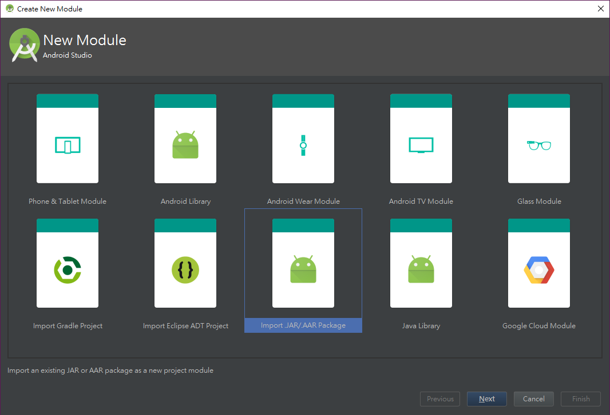
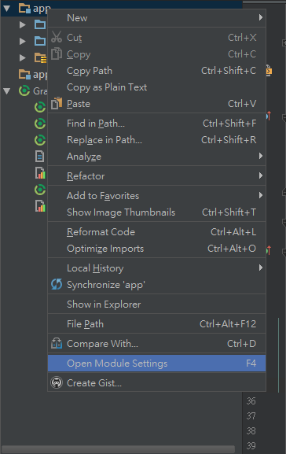
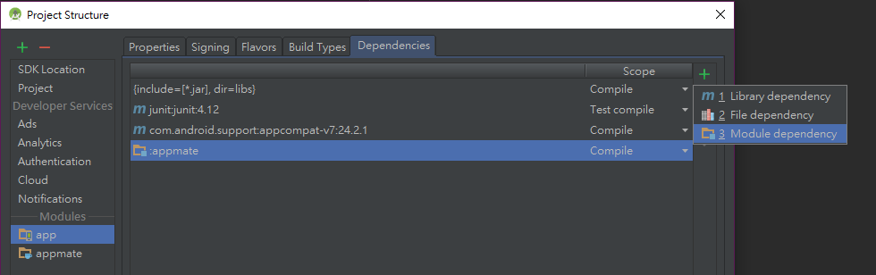

[^1]: https://github.com/APCLab/appmate
[^2]: https://github.com/APCLab/AppMateClient/releases
# Appmate client & demo

An API wrapper for [appmate][^1] and a demo app.

## Usage

1. Download the latest `.aar` file in [release][^2] page
2. Open your Android project
3. Add new module

    

4. Select `Import JAR/AAR Package`

    

5. Choose the arr file you saved previous and set the module name
6. Right click on your `app` module and select `open modlue settings`

    

7. At `Dependencies` tab, click `Add` on the right side and choose `Module dependency`

    

8. Select the module you just imported and click OK
9. Finish!

## API document

[here](https://apclab.github.io/AppMateClient/)
